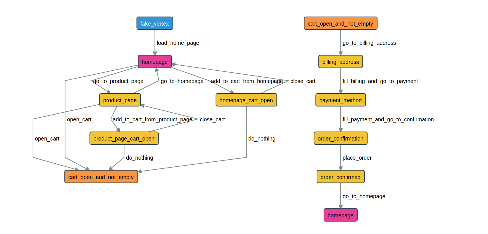

# E-Commerce Demo

In this example you will learn how to model your e-commerce website as a directional graph, how to use _actions_, _guards_ and _shared state_ in your graph model. You will learn how to use AltWalker's `online`, `offline`, `walk`, `check` and `verify` commands.

The tests are written in python with [selenium](https://selenium-python.readthedocs.io/) and [PyPOM](https://pypom.readthedocs.io/en/latest/) (Python Page Object Model). You can find the tests source code [here](https://gitlab.com/altom/altwalker/altwalker-examples/tree/master/ecommerce-snipcart-jekyll-example).

The e-commerce website beeing tested is written in markdown and uses [Jekyll](https://jekyllrb.com/) to generate static files. For cart and order management it uses [Snipcart](https://snipcart.com/). The website is hosted on [Gitlab Pages](https://altom.gitlab.io/altwalker/snipcart-jekyll-ecommerce-demo/) and its forked from [Snipcart on GitHub](https://github.com/snipcart/snipcart-jekyll-integration).

```eval_rst
.. contents:: Table of Contents
    :local:
    :backlinks: none
```

## Setup

For this Demo we used [geckodriver](https://github.com/mozilla/geckodriver) to launch the Firefox browser.

* Download [geckodriver](https://github.com/mozilla/geckodriver):

    After you download and extract the executable, make sure you set the path to the geckodriver executable in the `Path` variable to make other programs aware of its location.

    On Windows:

    ```
    $ set PATH=%PATH%;C:\bin\geckodriver
    ```

    On Linux/MacOS:

    ```
    $  ln -s /path/to/geckodriver /urs/local/bin/geckodriver
    ```

*  Clone the examples repository, with SSH:

    ```
    $ git clone git@gitlab.com:altom/altwalker/altwalker-examples.git
    ```

    Or with HTTPS:

    ```
    $ git clone https://gitlab.com/altom/altwalker/altwalker-examples.git
    ```

* Go into the e-commerce demo directory:

    ```
    $ cd altwalker-examples/ecommerce-snipcart-jekyll-example
    ```

* (__optional__) Create a python virtual environment:

    On Linux/MacOS:

    ```
    $ python3 -m venv .virtualenv
    $ source .virtualenv/bin/activate
    ```

    On Windows:

    ```
    $ python3 -m venv .virtualenv
    $ .virtualenv\Scripts\activate'
    ```

* Install the python dependencies:

    ```
    $ pip3 install -r requirements.txt
    ```

    Or:

    ```
    $ python3 -m pip install -r requirements.txt
    ```

## Modeling

We have modeled our e-commerce website as two graphs connected by two shared states. In our model file we specify which function is executed by AltWalker when we reach a vertex or an edge.

The `models/default.json` contains __NavigationModel__ and __CheckoutModel__:

* __NavigationModel__ contains edges and models that verify homepage and product page behaviour.
* __CheckoutModel__ contains edges and models that verify cart checkout process.

_Each vertex in the graph represents a state_ (e.g. `cart_not_empty`). This is where we put our asserts.

_Each edge in the graph represents an action_ (e.g. `add_to_cart`, `go_to_product_page`). This is where we put our page interaction code.

The following screenshot of the models is taken from the [Model-Editor](https://altom.gitlab.io/altwalker/model-editor/):



### Shared States

__NavigationModel__ and __CheckoutModel__ are linked together by `cart_open_and_not_empty` and `homepage` vertices.

The `cart_open_and_not_empty` in NavigationModel has the same `sharedState` value as `cart_open_and_not_empty` in CheckoutModel.

The `homepage` in NavigationModel has the same `sharedState` value as `homepage` in CheckoutModel.

If GraphWalker reaches `cart_open_and_not_empty` in NavigationModel model, it will continue on `cart_open_and_not_empty` in CheckoutModel, and if reaches `hompage` from _CheckoutModel_ it will continue on with `homplage` from _NavigationModel_.

### Actions and Guards

The `global.itemsInCart` variable is initialized at start in NavigationModel's actions:

```json
{
    "actions": [
        "global.itemsInCart = 0;"
    ]
}
```

The actions from the model level will be executed before any element from the model.

And its value is updated in `add_to_cart_from_homepage`, `add_to_cart_from_product_page` and `e_place_order`, where it's increased by one each time one of the three edges is reached:

```json
{
    "actions": [
        "global.itemsInCart++;"
    ]
}
```

The `cart_open_and_not_empty` vertex from _NavigationModel_ has 4 edges linked into it. All of the 4 edges are guarded by:

```json
{
    "guard": "global.itemsInCart > 0"
}
```

That means that GraphWalker will not generate a path that goes through the guarded edges unless `global.itemsInCart` is greater than 0.

This way we make sure that every time we reach `cart_open_and_not_empty` we have items in cart and we can jump to _CheckoutModel_.

## Tests

The tests can be found inside `tests` package.

We use [selenium](https://selenium-python.readthedocs.io/) and [PyPOM](https://pypom.readthedocs.io/en/latest/) (Python Page Object Model) to interact with the e-commerce website. The code that interacts with the page, is inside `tests/pages/` package.

Each model defined in `models/default.json` has an associated class in `tests/test.py`. The `models/default.json` contains two models: `NavigationModel` and `CheckoutModel`, so `test/test.py` contains two classes named after each model: `NavigationModel` and `CheckoutModel`.

Each model class has a method for each edge and vertex from the corresponding model.

During execution of tests, whenever the path reaches the vertex with the id `v_homepage` defined in the `NavigationModel` model, AltWalker will execute the method:

```
tests/test.py::NavigationModel::homepage
```

### Structure

```
tests/
    pages/
        __init__.py
        base.py
        home.py
        product.py
    __init__.py
    test.py
```

Inside `tests/page/` we define our Page Object Model for the home and product pages.

Inside `tests/test.py` we define our test code for our model(s).

### Fixtures

We use the `setUpRun` and `tearDown` fixtures to manage Selenium's WebDriver session.

Inside the `setUpRun` function we create the selenium driver:

```python
def setUpRun():
    # ...

    print("Create a new Firefox session")
    driver = webdriver.Firefox(options=options)

    # ...
```

And in the `tearDownRun` we close the driver:

```python
def tearDownRun():
    # ...

    print("Close the Firefox session")
    driver.quit()
```

### Further Reading/Useful Links

* [Selenium](https://docs.seleniumhq.org/)
* [Selenium with python](https://selenium-python.readthedocs.io/)
* [PyPOM (Python Page Object Model)](https://pypom.readthedocs.io/en/latest/)

## Run Tests

### `check`

```
$ altwalker check -m models/default.json "random(edge_coverage(100))"
```

Checks the integrity of the model.
- runs GraphWalker's check command
- runs AltWalker's checks on json models integrity


### `verify`

```
$ altwalker verify -m models/default.json tests
```

Verifies that your model and tests are valid, and that all names referred in the model are implemented in `tests/test.py` module.

### `online`

```
$ altwalker online -m models/default.json "random(edge_coverage(100))" tests
```

Walks randomly through the graph until all edges have been passed.

- starts GraphWalker REST service on the default port 8887.
- initializes GraphWalker with model(s) form `models/default.json` and `random(edge_coverage(100))` generator and stop condition.
- communicates with GraphWalker to get next step to be executed
- executes the test in `tests` package associated with the step

### `offline` and `walk`

```
$ altwalker offline -m models/default.json "random(edge_coverage(100) && vertex_coverage(100))" -f steps.json
```

Generates a valid path through the test graph.
* runs GraphWalker's offline command to generate a list of valid steps through the graph.
* saves the list of steps into `steps.json`

```
$ altwalker walk tests ./steps.json
```

Walks on the steps in `./steps.json` file.
- reads steps from file
- executes, in the order from file, the tests in `tests` package associated with each step
