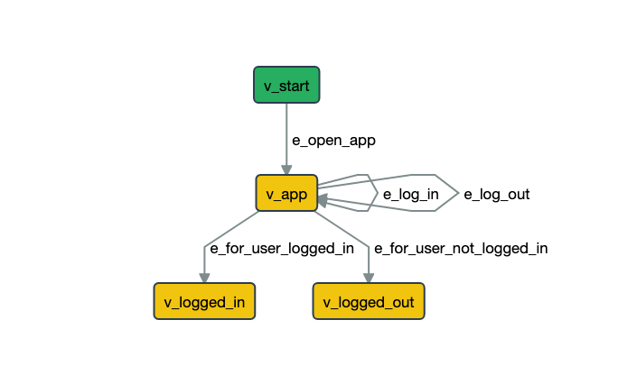

======================
Use actions and guards
======================

**Actions** and **Guards** provide a way to split the test based on the data which you use. That
approach allows you to reuse/combine/change the data for each test separately. It lets you
to test login with different credentials, or iteration through boundary values and
equivalent classes.

.. contents:: Table of Contents
    :local:
    :backlinks: none

Overview
--------

GraphWalker keeps a context for each model plus a global context. A context is a set of variables.

GraphWalker has two way to interact with the data from the context:

1. **Actions** allow you to initialize and update the data from the context.
2. **Guard** allows you to block (guard) edges until a condition is meet.

Each model has a unique set of variables, so if you want to use variables across models
you must save them in the global context. Every variable of the form ``global.<variable-name>`` is
saved in the global context (e.g. ``global.count``, ``global.isLoggedIn``).

.. note::
    Throughout the documentation the data from the context is usually referred as `graph data`
    or just `data`.

Actions
~~~~~~~

An **action** is a piece of Java code executed by GraphWalker. You can place
action on the model level which will be executed before any step from that model or
on an edge which will be executed when an edge is reached.

**Examples**:

.. code-block:: json

    {
        "actions": [
            "global.count++;",
            "isUserLoggedIn = false;"
        ]
    }

.. note::
  Each action must end with ``;`` (e.g. ``count++;`` is a valid action while ``count++`` is not).

Guards
~~~~~~

A **guard** is a piece of Java code which if evaluates as `false` marks an **edge** as unreachable,
the **guard** can use the variables from the context of the current model of the global context.

**Examples**:

.. code-block:: json

    {
        "guard": "isUserLoggedIn == false",
    }

.. code-block:: json

    {
        "guard": "globbal.count > 10",
    }

Log In Example
--------------

Let’s consider the model below which has a login test (``v_logged_in``) and a logout test (``v_logged_out``).
Note that the two vertices could reference another models with the rest of the functionality, for
logged in users respectively logged out users, but for the simplicity of the example we are using only two
vertices.

Model visualization:

    Screenshot taken from the Model-Editor.

Model source:

.. literalinclude:: ../_static/models/login.json
    :language: json
    :emphasize-lines: 8-10, 40-42, 50-52

The idea is that:

* At first ``isUserLoggedIn`` is set to ``false`` by the models actions.
* Go on ``v_start`` which is the starting point.
* Go on ``e_open_app`` and launch the application.
* Now we are on the ``v_app`` vertex.

And from here there are two paths:

1. **Not Logged In Path**:

* Now we can go on ``e_for_user_not_logged_in`` edge for which the guard condition
  (``isUserLoggedIn == false``) is meet.
* Now we are on ``v_logded_out`` where we have some test which don't need a logged in user.

2. **Logged In Path**:

* Go on the ``e_log_in`` edge, wich will set ``isUserLoggedIn`` to ``true``.
* Now we can go on ``e_for_user_logged_in`` edge because the guard condition (``isUserLoggedIn == true``) is meet.
* Now we are on ``v_logded_in`` where we have some test for a logged in user.

.. only:: builder_html

    .. admonition:: And, by the way...

        You can download the model: :download:`login.json <../_static/models/login.json>`.

        And use the ``init`` command to generate a project from the model (for pyhon or c#):

        .. code-block:: console

            $ altwalker init action-example -m login.json -l [python|c#]

        And then you can run the example.

        If you need help with the ``init`` command check out the :doc:`../quickstart` section.

Further Reading/Useful Links
----------------------------

* GraphWalker documentation on:
    * `Tests parametrisation <http://graphwalker.github.io/tests_parametrisSation/>`_
    * `JSON File Format <http://graphwalker.github.io/json-overview/>`_
* AltWalker documentation on:
    * :doc:`../modeling`
