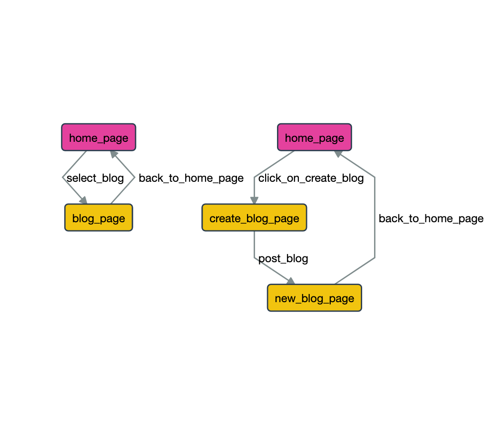

=================
Use shared states
=================

**Shared states** provide a way to split your models into smaller models that are linked together
by one vertex from each model that have the same **shared state**.

.. contents:: Table of Contents
    :local:
    :backlinks: none

Overwiew
--------

GraphWalker allows you to link together two (or more) models with a **shared state**. Each *shared state* has a name
that identifies it, every vertex that have the same name are linked.

If two (or more) vertices have the same **shared state** now the path can jump from one vertex to another.

.. notes::

    When you are using a *shared state* between two or more vertices the path can jump from one to every other one.

**Examples**:

.. code-block:: json

    {
        "id": "v_0",
        "name": "v_link_a",
        "sharedState": "link"
    }

.. code-block:: json

    {
        "id": "v_1",
        "name": "v_link_b",
        "sharedState": "link"
    }

Now when generating a path you can have a jump from ``v_0`` to ``v_1`` or from ``v_1`` to ``v_0``.

Blog example
------------

Let’s consider the models below the ``Navigation`` model where we model the navigation for our bloging
website (for simplicity we make only one vertex and edge) and the ``PostBlog`` model whre we model
the posting of a new blog.

Model visualization:

    Screenshot taken from the Model-Editor.

Model source:

.. literalinclude:: ../_static/models/blog.json
    :language: json
    :emphasize-lines: 12, 41

Now we separated the navigation of the home page from the bloging, this way our models are easier to mantaine.

.. only:: builder_html

    .. admonition:: And, by the way...

        You can download the model: :download:`blog.json <../_static/models/blog.json>`.

        And use the ``init`` command to generate a project from the model (for pyhon or c#):

        .. code-block:: console

            $ altwalker init action-example -m blog.json -l [python|c#]

        And then you can run the example.

        If you need help with the ``init`` command check out the :doc:`../quickstart` section.

Further Reading/Useful Links
----------------------------

* GraphWalker Documentation for `JSON vertex format <http://graphwalker.github.io/json-vertex/>`_.
* AltWalker Documentation for :doc:`../modeling`.
