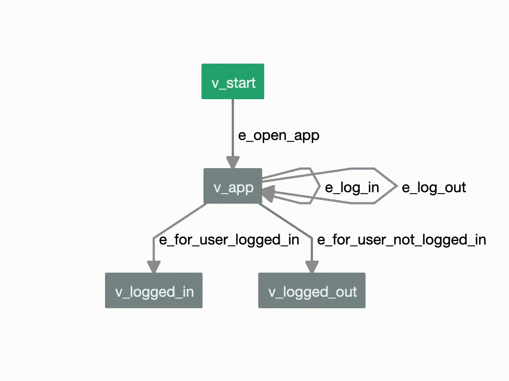

=====================================
Welcome to AltWalker's documentation!
=====================================

AltWalker is an open source Model-Based Testing framework that supports running
tests written in python3 and .NET/C#. You design your tests as a directed graph
and AltWalker generates test cases from your graph (using `GraphWalker <http://graphwalker.github.io/>`_)
and executes them.

Get started with :doc:`installation` and then get a quick overview with
the :doc:`quickstart`. There is also a list of :doc:`how-tos` and a list
of runnable :doc:`examples`. The rest of the documentation describes
how to use each feature of AltWalker in more details.

Join our Gitter chat room `here <https://gitter.im/altwalker/community>`_ to chat
with us or with other members of the community.

Documentation
=============

This part of the documentation guides you through all of the library's
usage patterns.

.. toctree::
    :maxdepth: 2

    overview
    installation
    quickstart
    core
    examples
    how-tos
    faq
    cli
    api
    contributing
    changelog
    license

.. toctree::
    :caption: Useful Links:

    PyPI Releases <https://pypi.org/project/altwalker/>
    Source Code <https://gitlab.com/altom/altwalker/altwalker>
    Model Editor <https://altom.gitlab.io/altwalker/model-editor>
    Issue Tracker <https://gitlab.com/altom/altwalker/altwalker/issues>
    Docker Hub <https://hub.docker.com/u/altwalker>

.. toctree::
    :caption: Other Executors:

    C#/.NET <https://www.nuget.org/packages/AltWalker.Executor/>

.. toctree::
    :caption: Community:

    Gitter <https://gitter.im/altwalker/community>
    Libraries.io <https://libraries.io/pypi/altwalker>

Indices and Tables
==================

* :ref:`genindex`
* :ref:`modindex`
* :doc:`glossary`
* :ref:`search`
