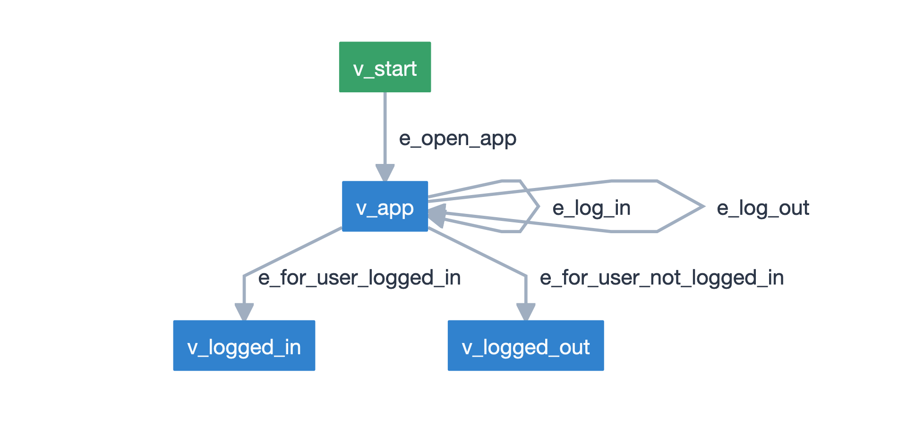
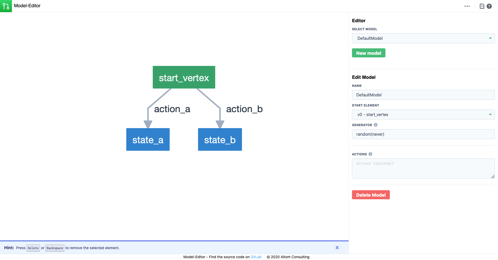
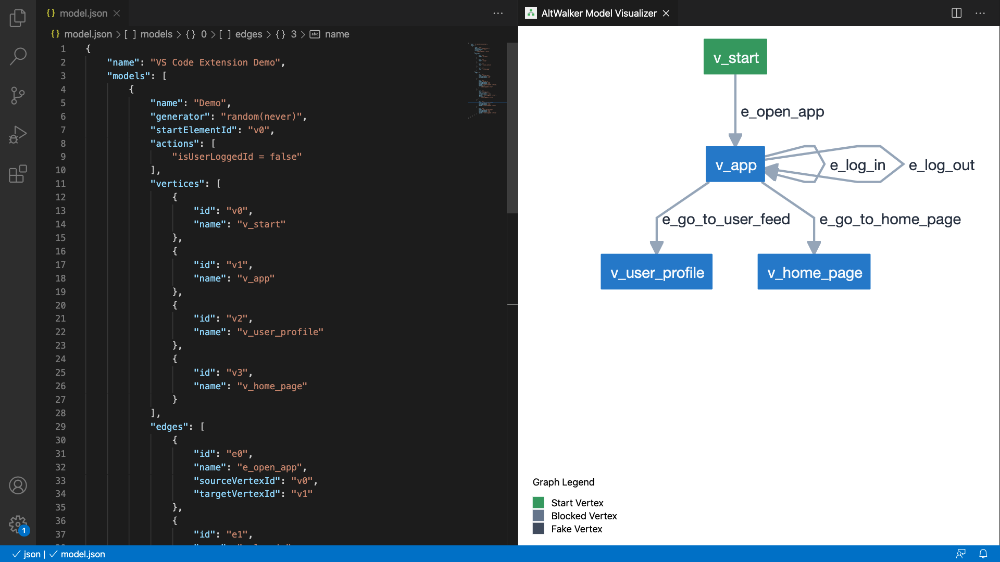

========
Modeling
========

The first step of :term:`MBT` is modeling.

Modeling is the process of translating the behavior and functionalities of the
:term:`SUT` into an abstract model. We call it an abstract model because it should
be much smaller and simpler than the :term:`SUT` itself. It should focus on just
the aspects that you want to test and should omit any other details of the :term:`SUT`.

Model Design
------------

The objective of the model, is to express the expected behavior of the :term:`SUT`.

A model is reminiscent of the concept of a :term:`Finite-State Machine <FSM>` or a
:term:`Directed Graph`, in which a vertex (or a node) represents some desired state, and the
edges (arcs, arrows, transitions) represents whatever actions we need to do in order
to get to the desired state.

Each *vertex* and *edge* has an associated method in the test code that is executed
when the element is reached.

    A simple model visualized as a directed graph.

Vertices
~~~~~~~~

A **vertex** is a state of the system under tests. In the test code
this is the place where the actual test (*asserts*) takes place.

Edges
~~~~~

An **edge** is an action that takes the system under tests form one state (vertex)
to another.

Generators and Stop Conditions
~~~~~~~~~~~~~~~~~~~~~~~~~~~~~~

**Generators** and **stop conditions** are how GraphWalker decides how to travel
the model(s) (directed graph) and when the path (test sequence) is completed.

A **generator** is an algorithm that decides how to traverse a model. Different
generators will generate different test sequences, and they will navigate in different
ways.

A **stop condition** is responsible for deciding when a path is completed. The
**generator** will generate a new step in the path until the **stop condition**
is met.

**Examples**

.. code::

    random(never)

.. code::

    weighted_random(time_duration(100))

.. code::

    a_start(reached_vertex(vertex_A))

.. note::

    Throughout the documentation a pair of a generator and a stop condition is
    usually referred as a stop condition.

**Further Reading/Useful Links**

- Read more on Generators and Stop Conditions in the :doc:`path-generation` section.
- For documentation about Generators and Stop Conditions check `GraphWalker's documentation <https://github.com/GraphWalker/graphwalker-project/wiki/Generators-and-stop-conditions>`_

Actions
~~~~~~~

GraphWalker keeps an execution context with data for each model and a global context.

By default GraphWalker tries to access data from the current model context. To access
data from the global context, prefix the variable name with ``global.`` (e.g. ``global.count``,
``global.isLoggedIn``).

An **action** is a piece of JavaScript code that you want the model to execute, in order to
modify the data from the context.

Actions can only be placed at an edge or model level. Actions from the model level are
executed once, and actions defined on an edge are executed every time the edge is reached.

.. tip::

  Always initialize your variables in the models level actions.

  Note that you can also initialize variables in the global context.

**Example**

.. code-block:: json

    {
        "actions": [
            "numOfPets++;",
            "isLoggedIn = true;"
        ]
    }

And to update variable from the global context:

.. code-block:: json

    {
        "actions": [
            "global.numOfPets++;"
        ]
    }

.. note::

  Each action must end with ``;`` (e.g. ``count++;``, ``isLoggedIn = true;``).

**Further Reading/Useful Links**

- Read more on :doc:`../how-tos/actions-and-guards` section.

Guards
~~~~~~

A **guard** marks an **edge** as unreachable until the condition it specifies is met. The
**guard** is expressed using the data from the context.

Guards can only be placed on edges.

**Example**

.. code-block:: json

    {
        "guard": "numOfPets > 0"
    }

Like with **actions** if you want to use data from the global context, prefix the variable name with ``global.``.

.. code-block:: json

    {
        "guard": "global.numOfPets > 0"
    }

**Further Reading/Useful Links**

- Read more on :doc:`../how-tos/actions-and-guards` section.

Formats
-------

AltWalker like GraphWalker supports two formats for models:

- json
- grapml

JSON
~~~~

The template for a *json* file:

.. code-block:: json

    {
        "name": "<Name of the test suite>",
        "models": [
            {
                "<MODEL IN JSON FORMAT>"
            },
            {
                "<MODEL IN JSON FORMAT>"
            }
        ]
    }

Multiple models and their data can be stored in one single json file.

Model
=====

The template for a *model*:

.. code-block:: json

    {
        "generator": "<The generator of the model>",
        "id": "<The unique id of the model>",
        "name": "<The name of the model>",
        "actions": [
            "<ACTION IN JSON FORMAT>",
            "<ACTION IN JSON FORMAT>"
        ],
        "edges": [
            "<EDGE IN JSON FORMAT>",
            "<EDGE IN JSON FORMAT>"
        ],
        "vertices": [
            "<VERTEX IN JSON FORMAT>",
            "<VERTEX IN JSON FORMAT>"
        ]
    }

- ``action`` field is optional.

Vertex
======

The template for a *vertex*:

.. code-block:: json

    {
        "id": "<The unique id of the vertex>",
        "name": "<The name of the vertex>",
        "sharedState": "<SHARED STATE NAME>",
        "properties": {
            "blocked": "true/false",
            "key1": "<value1>",
            "key2": "<value2>"
        },
        "requirements": [
            "<Requirement Tag>",
            "<Requirement Tag>"
        ]
    }

- ``sharedState`` field is optional, it can be used to link to vertices from different
  models. Any vertices with the same value for ``sharedState`` are linked.
- ``properties`` field is optional, it can be used to store pairs of key/data.
- ``properties.blocked`` field is optional, if set and the commands are run with the
  ``--blocked`` flag the vertex will be filtered out of the path selection.
- ``requirements`` field is optional, it can be used to set tags on vertices and use
  them with ``requirement_coverage``.

  Read more about ``requirements`` on :ref:`core/path-generation:Requirement Coverage`.

Edge
====

The template for an *edge*:

.. code-block:: json

    {
        "id": "<The unique id of the edge>",
        "name": "<The name of the edge>",
        "sourceVertexId": "<The id of the source vertex of this edge>",
        "targetVertexId": "<The id of the target, or destination vertex of this edge>",
        "guard": "<The conditional expression which enables the accessibility of this edge>",
        "actions": [
            "<ACTION IN JSON FORMAT>",
            "<ACTION IN JSON FORMAT>"
        ],
        "weight": "<The weight>",
        "dependency": "<The dependency>",
    }

- ``guard`` field is optional, it can be used to set a guard on this edge.
- ``actions`` field is optional.
- ``weight`` field is optional, it can be used to set weights and use them with `weighted_random`.

  Read more about ``weight`` on :ref:`core/path-generation:Weighted Random`.

- ``dependency`` field is optional, it can be used to set dependencies and use them with `dependency_edge_coverage`.

  Read more about ``dependency`` on :ref:`core/path-generation:Dependency Edge Coverage`.

Action
======

The template for an *action*:

.. code-block:: json

    {
        "actions": [
            "<JavaScript>;",
            "<JavaScript>;"
        ]
    }

Is a piece of JavaScript code that you want the model to execute.

It has to end with a semicolon (``;``).

Further Reading/Useful Links
============================

- For documentation about **json** format check `GraphWalker documentation <https://github.com/GraphWalker/graphwalker-project/wiki/JSON-file-format>`_.
- For creating or modifying json models you can use `AltWalker's model editor <https://altwalker.github.io/model-editor>`_.

GraphML
~~~~~~~

`GraphML <https://en.wikipedia.org/wiki/GraphML>`_ is an XML-based file format for graphs.

A single model and his data can be stored in one single ``.graphml`` file. The name of the
model is the name of the file (e.g. for ``login.graphml`` the name of the model is ``login``).

.. admonition:: Recommendation

  If you intent to use the ``graphml`` format we recommend considering using the ``json`` format. AltWalker is mainly tested using ``json`` models and all the example from the
  documentation use the ``json`` format.

  If you have models in the ``graphl`` format we recommend converting them using the `convert <https://github.com/GraphWalker/graphwalker-project/wiki/Convert>`_ command form GraphWalker.

  **Example**

  .. code-block:: console

    $ gw convert -i login.graphml -f json

**Further Reading/Useful Links**

- `GraphML <https://en.wikipedia.org/wiki/GraphML>`_ file format.
- For documentation about the ``.graphml`` model format check `GraphWalker's documentation on Using yEd <https://github.com/GraphWalker/graphwalker-project/wiki/Creating-a-model-using-yEd>`_.
- For creating or modifying graphml models you can use `yEd editor <http://www.yworks.com/en/products_yed_about.html>`_.

Checking the models
-------------------

You can also check for issues in the model(s) using the `check` command:

.. code-block:: console

    $ altwalker check -m path/to/model.json "generator(stop_conditions)"

**Examples**

.. command-output:: altwalker check -m models/login.json "quick_random(vertex_coverage(100))"
  :cwd: ../_static/
  :returncode: 0

.. command-output:: altwalker check -m models/invalid.json "quick_random(edge_coverage(100))"
  :cwd: ../_static/
  :returncode: 4

Tooling
-------

Tools for JSON
~~~~~~~~~~~~~~

For **JSON** you can check `AltWalker's Model-Editor <https://altwalker.github.io/model-editor>`_, the editor
allows you to visualize and edit your models.

    Screenshot taken from the Model-Editor.

And if you are using VS Code you can check out the `AltWalker's Model-Visualizer Extension <https://marketplace.visualstudio.com/items?itemName=Altom.altwalker-model-visualizer>`_, the extension
allows you to visualize your model while you are working on it.

    Screenshot taken from the AltWalker Model-Visualizer VS Code Extension.

Tools for GraphML
~~~~~~~~~~~~~~~~~

For **GraphML** you can use `yEd editor <http://www.yworks.com/en/products_yed_about.html>`_ and GraphWalker
has a tutorial on how to `design models <https://github.com/GraphWalker/graphwalker-project/wiki/Creating-a-model-using-yEd>`_ using it.
