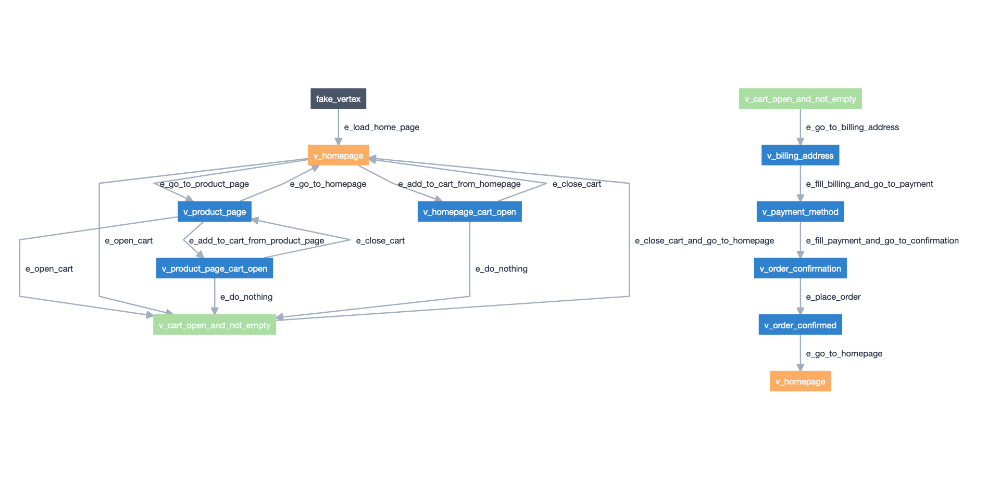
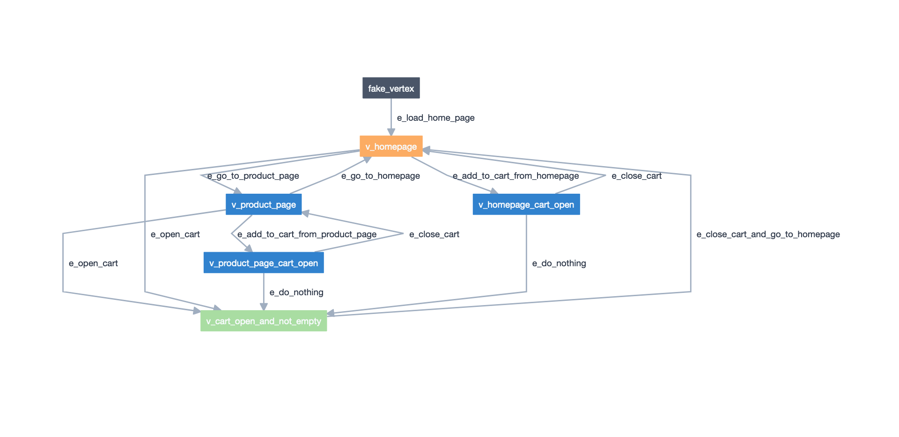
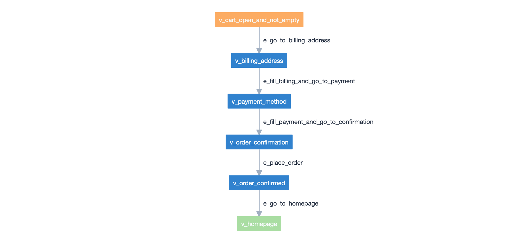

=======================
.NET/C# E-Commerce Demo
=======================

.. meta::
   :description: How to run model-based tests in C#/.NET with Selenium for an e-commerce site
   :keywords: AltWalker, Model-Based Testing, C#, .NET, Selenium, WebDriver
   :image: _static/ecommerce-model.png

In this example you will learn how to model your e-commerce website as a
directional graph, how to use *actions*, *guards* and _shared *state*
in your graph model. You will learn how to use AltWalker's ``online``,
``offline``, ``walk``, ``check`` and ``verify`` commands.

The tests are written in C# with Selenium_.
You can find the tests source code `here <https://github.com/altwalker/altwalker-examples/tree/main/dotnet-ecommerce>`_.

The e-commerce website being tested is written in markdown and uses Jekyll_
to generate static files. For cart and order management it uses Snipcart_.
The website is hosted on `GitHub Pages <https://altwalker.github.io/jekyll-ecommerce/>`_ and its
forked from `Snipcart on GitHub <https://github.com/snipcart/snipcart-jekyll-integration>`_.

Page Object Pattern
-------------------

    *Page Object* is a Design Pattern which has become popular in test
    automation for enhancing test maintenance and reducing code duplication.
    A page object is an object-oriented class that serves as an interface to
    a page of your :term:`AUT`. [...] The benefit is that if the UI changes for
    the page, the tests themselves don’t need to change, only the code within
    the page object needs to change.

    -- `Selenium | Page object models <https://selenium.dev/documentation/en/guidelines_and_recommendations/page_object_models/>`_

Model-Based Testing with Page Object Pattern
~~~~~~~~~~~~~~~~~~~~~~~~~~~~~~~~~~~~~~~~~~~~

When you are using Model-Based Testing with Page Object Pattern:

* the Page Object Pattern separates your test code from the specific code
  that interacts with the :term:`AUT`
* the Model-Based Tests separates your test code from the flow of the
  :term:`AUT` by abstracting the flow in the models.

Now if the UI changes you will only need to update the Page Objects and
all the flows (from the model) will reflect the new changes. And if
the flow changes you will only need to add new element to your model.

Setup
-----

*  Clone the examples repository, with SSH:

.. tab:: SSH

    .. code-block:: console

        git clone git@github.com:altwalker/altwalker-examples.git

.. tab:: HTTPS

    .. code-block:: console

        git clone https://github.com/altwalker/altwalker-examples.git

* Go into the e-commerce demo directory:

.. code-block:: console

    cd altwalker-examples/dotnet-ecommerce

* Install nuget packages:

.. code-block:: console

    dotnet restore

Modeling
--------

We have modeled our e-commerce website as two graphs connected by two shared
states. One of the models handles the navigation process of selecting a product
and adding it to the cart and the other model handles the checkout process.

Each *vertex* in the graph represents a state (e.g. ``v_cart_not_empty``). This
is where we put our asserts.

Each *edge* in the graph represents an action (e.g. ``e_add_to_cart``,
``e_go_to_product_page``). This is where we put our page interaction code.

   Screenshot of the models taken from the Model-Editor_.

The ``models/navigation.json`` contains **NavigationModel** and the
``models/checkout.json`` **CheckoutModel**:

* **NavigationModel** contains edges and vertices that verify homepage and
  product page behavior.

   Screenshot of the **NavigationModel** taken from the Model-Editor_.

* **CheckoutModel** contains edges and vertices that verify the checkout
  process.

   Screenshot of the **CheckoutModel** taken from the Model-Editor_.

Shared States
~~~~~~~~~~~~~

**NavigationModel** and **CheckoutModel** are linked together by two shared
states:

    * ``cart-open``: The ``v_cart_open_and_not_empty`` from NavigationModel
      is linked with ``v_cart_open_and_not_empty`` from CheckoutModel.
    * ``homepage``: The ``v_homepage`` from NavigationModel is linked with
      ``v_homepage`` from CheckoutModel.

.. note::

    To link to vertices from two models they need the have the same
    shared state value, the name of the vertices doesn't have to be the same.

If GraphWalker reaches ``v_cart_open_and_not_empty`` from *NavigationModel*
model, it will continue on ``v_cart_open_and_not_empty`` in *CheckoutModel*,
and if reaches ``v_homepage`` from *CheckoutModel* it will continue on with
``v_homepage`` from *NavigationModel*.

Separating the model in two smaller models it makes the model and the code
more maintainable. This makes also easy to run tests with only one model
that test just a behavior.

Modelling is development work just like coding. Use normal coding good
practices like will make your life easier later.

Actions and Guards
~~~~~~~~~~~~~~~~~~

The ``global.itemsInCart`` variable is initialized at start in
NavigationModel's actions:

.. code-block:: json

    {
        "actions": [
            "global.itemsInCart = 0;"
        ]
    }

The actions from the model level will be executed before any element
from the model.

And its value is updated in ``add_to_cart_from_homepage``,
``add_to_cart_from_product_page`` and ``e_place_order``, where it's
increased by one each time one of the three edges is reached:

.. code-block:: json

    {
        "actions": [
            "global.itemsInCart++;"
        ]
    }

The ``cart_open_and_not_empty`` vertex from *NavigationModel** has
4 edges linked into it. All of the 4 edges are guarded by:

.. code-block:: json

    {
        "guard": "global.itemsInCart > 0"
    }

That means that GraphWalker will not generate a path that goes
through the guarded edges unless ``global.itemsInCart`` is greater than 0.

This way we make sure that every time we reach ``cart_open_and_not_empty``
we have items in cart and we can jump to **CheckoutModel**.

Tests
-----

The tests project can be found inside ``tests`` directory.

We use Selenium_ to interact with the e-commerce website. The code that
interacts with the page, is inside ``pages`` namespace.

Each model defined in ``models/default.json`` has an associated class in
``tests/``. The ``models/default.json`` contains two models:
``NavigationModel`` and ``CheckoutModel``. Inside tests you can
find ``CheckoutModel.cs`` and ``NavigationModel.cs``.

Each model class has a method for each edge and vertex from the corresponding
model.

During execution of tests, whenever the path reaches the vertex with
the id ``v_homepage``, and name ``homepage`` defined in the
``NavigationModel`` model, AltWalker will execute the method:
``tests/NavigationModel.cs::NavigationModel::homepage``

Structure
~~~~~~~~~

.. code::

    tests/
        pages/
            base.cs
            home.cs
            product.cs
        NavigationModel.cs
        CheckoutModel.cs
        Program.cs
        ecommerce-snipcart-jekyll-example-dotnet.csproj

Inside ``tests/pages`` we define the classes that interact with home and
product page. We also define a base class which interacts with all pages
on our website.

Inside ``tests/NavigationModel.cs`` and  ``tests/CheckoutModel.cs`` we
define our test code for our model(s).

Inside `Main` function, we register the models in the `ExecutorService`.

.. code-block:: C#

    service.RegisterModel<NavigationModel>();
    service.RegisterModel<CheckoutModel>();

Fixtures
~~~~~~~~

We use the ``setUpRun`` and ``tearDown`` :term:`fixtures<Test Fixture>` to
manage Selenium's WebDriver session. The methods are defined in
``Program.cs::Setup`` and the Setup class is registered in the
``ExecutorService``.

.. code-block:: C#

    service.RegisterSetup<Setup>();

Inside the ``setUpRun`` function we create the selenium driver:

.. code-block:: C#

    public void setUpRun()
    {
        FirefoxOptions options = new FirefoxOptions();
        options.AddArguments("--headless");

        TestContext.driver = new FirefoxDriver(options);
        TestContext.driver.Manage().Timeouts().ImplicitWait = TimeSpan.FromSeconds(5);
    }

And in the ``tearDownRun`` we close the driver:

.. code-block:: C#

    public void tearDownRun()
    {
        TestContext.driver.Quit();
    }

Checking the Models
-------------------

.. code-block:: console

    altwalker check -m models/navigation.json "random(edge_coverage(100))"

Checks the integrity of the model(s).

You can also check multiple models this will also check that all models can be
reached.

.. code-block:: console

    altwalker check -m models/navigation.json "random(edge_coverage(100))" -m models/checkout.json "random(vertex_coverage(100))"

Verifying the Code
------------------

.. code-block:: console

    altwalker verify -l c# -m models/navigation.json tests

Verifies that your model and tests are valid, and that all names
referred in the model are implemented in ``tests`` package.

Running the Tests
-----------------

AltWalker provides two ways of running the tests:

    * Online Mode (On the fly)
        Generate one step at a time and execute it.

    * Offline Mode
        Generate a list of steps which can be executed later.

Online Mode
~~~~~~~~~~~

.. code-block:: console

    altwalker online -l c# -m models/navigation.json "quick_random(edge_coverage(100))" tests

Walks randomly through the graph until all edges have been passed.

You can also run tests with two models.

.. code-block:: console

    altwalker online -l c# -m models/navigation.json "random(edge_coverage(100))" -m models/checkout.json "random(edge_coverage(100))" tests

Offline Mode
~~~~~~~~~~~~

.. code-block:: console

    altwalker offline -m models/navigation.json "random(length(15))" -f steps.json

Generates a valid path through the test graph and saves the list of
steps into ``steps.json``.

.. note::

    The offline command doesn't run the tests it only generates a path.

.. code-block:: console

    altwalker walk -l c# tests steps.json

Executes (walks on) the steps from the ``steps.json`` file.

.. _Model-Editor: https://github.com/altwalker/model-editor
.. _Selenium: https://docs.seleniumhq.org
.. _geckodriver: https://github.com/mozilla/geckodriver/releases
.. _Jekyll: https://jekyllrb.com
.. _Snipcart: https://snipcart.com
