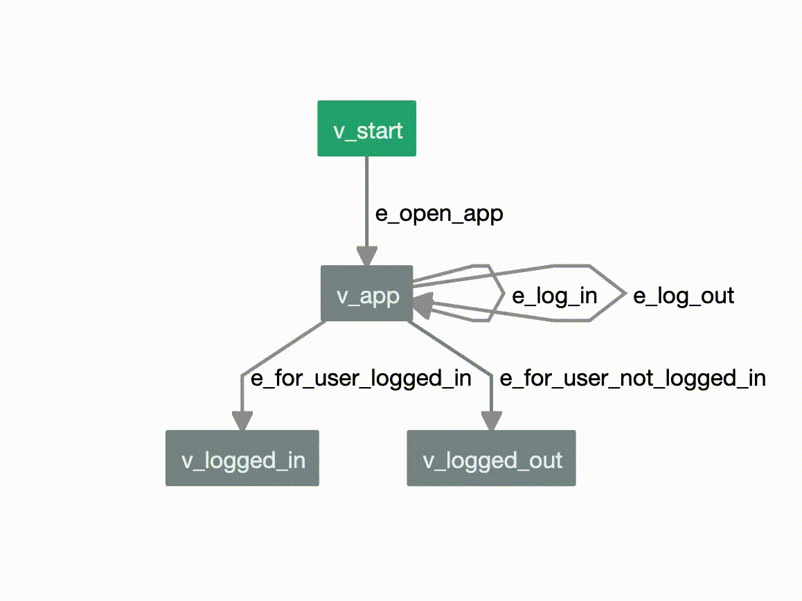

=====================================
Welcome to AltWalker's documentation!
=====================================

AltWalker is an open source Model-Based Testing framework that supports running
tests written in Python3 and .NET/C#. You design your tests as a directed graph
and AltWalker generates test cases from your graph (using `GraphWalker`_)
and executes them.

Get started with :doc:`installation` and then get a quick overview with
the :doc:`quickstart`. There is also a list of :doc:`how-tos` and a list
of runnable :doc:`examples`. The rest of the documentation describes
how to use each feature of AltWalker in more details.

Join our `Gitter chat room <https://gitter.im/altwalker/community>`_ or
our `Google Group <https://groups.google.com/g/altwalker>`_ to chat
with us or with other members of the community.

Documentation
=============

This part of the documentation guides you through all of the library's
usage patterns.

.. toctree::
   :maxdepth: 2

   overview
   installation
   quickstart
   core
   examples
   how-tos
   cli
   api
   faq
   contributing
   changelog
   license

.. toctree::
    :caption: Useful Links:

    Source Code <https://github.com/altwalker/altwalker>
    Issue Tracker <https://github.com/altwalker/altwalker/issues>
    PyPI Releases <https://pypi.org/project/altwalker/>
    Docker Hub <https://hub.docker.com/u/altwalker>
    Model Editor <https://altwalker.github.io/model-editor>
    VS Code Extension <https://marketplace.visualstudio.com/items?itemName=Altom.altwalker-model-visualizer>

.. toctree::
    :caption: Other Executors:

    C#/.NET <https://www.nuget.org/packages/AltWalker.Executor/>

.. toctree::
    :caption: Community:

    Google Group <https://groups.google.com/g/altwalker>
    Gitter <https://gitter.im/altwalker/community>
    Libraries.io <https://libraries.io/pypi/altwalker>

Indices and Tables
==================

* :ref:`genindex`
* :ref:`modindex`
* :doc:`glossary`
* :ref:`search`

.. _GraphWalker: http://graphwalker.github.io/
